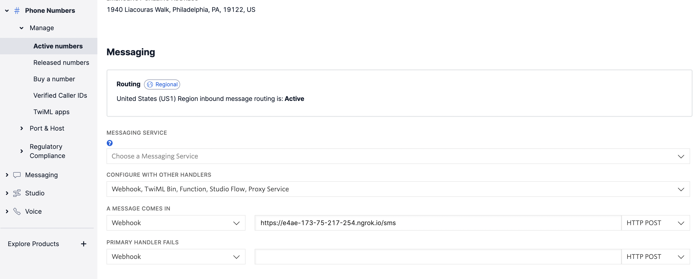
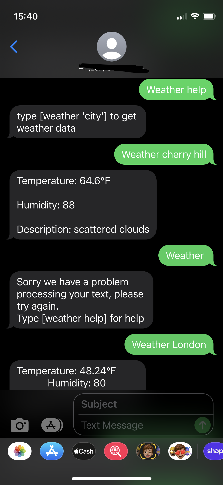

# SMS-Twilio-Weather-app
Built a sms weather app using twilio, openweathermap, python, flask, ngrok<br>
To build this app you will need
- a phone number from twilio (need to purchase it)
- following python packages(I used pipenv to install)
    - twilio
    - flask
    - requests
    - python-dotenv
- also you need [ngrok](https://ngrok.com/) to temporary host your app
***
# Starting Application
```
python3 src/main.py
```
- Note: The default port is 5000, if you are using a mac change it in your code. For instance mine is 8080.

# Publicly Host Application 
```
ngrok http 8080
```
- Your port number may be different, please check flask app.
# Add webhook to twilio

- This is the output from ngrok, remember to add '/sms' at the end of the url and save.
# Result!!!! 🥳

